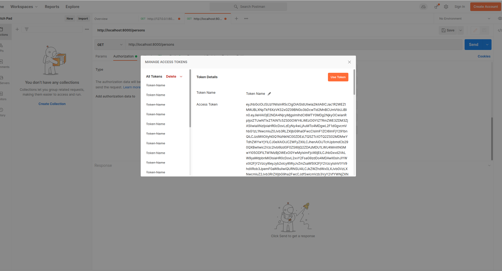

# Springboot & Keycloak

## About the project
Keycloak is an open-source identity and access management solution for modern applications and services. Keycloak provides both SAML and OpenID protocol solutions.

In this project, I have integrated keycloak with a springboot application to manage user, authentication and authorization.


<hr>

## Stacks

- Java
- Springboot
- Postgres
- Keycloak

<br/><hr><br/>

### Steps to run the project


1. Download and run keycloak([Need a hand?](https://www.keycloak.org/getting-started)). I've found the docker one easier. If you have docker installed, fire up a terminal and type ```docker run -p 8080:8080 -e KEYCLOAK_USER=admin -e KEYCLOAK_PASSWORD=admin quay.io/keycloak/keycloak:16.1.0```
2. This will start a keycloak instance on port 8080. go the that link, create an admin, then you will see keycloak homepage  
3. Create a Realm, Then create a client, add some role and users
4. Copy the token endpoint from ```OpenID endpoint Configuration```
5. Run the springboot application with appropriate database and keycloak properties in application.properties
6. Test in Postman! 



Need some detailed help on this? Watch [this video](https://www.youtube.com/watch?v=rcvAmBoDlLk) or Read [this article](https://betterjavacode.com/programming/spring-boot-application-keycloak). They helped me too! thanks to the authors.

<br/><hr><br/>